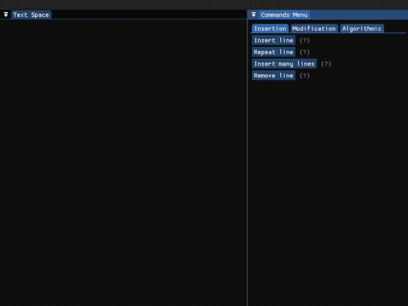
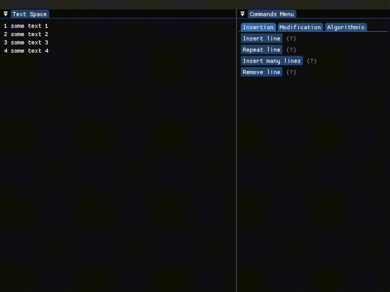
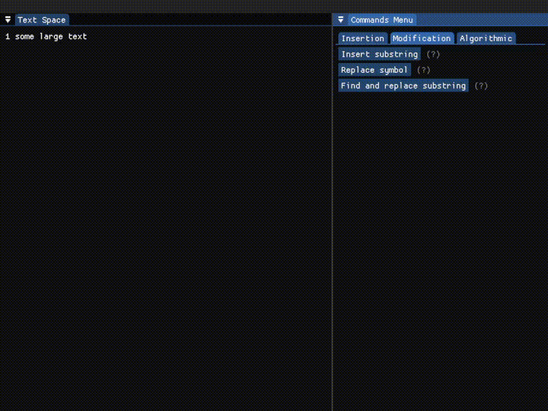
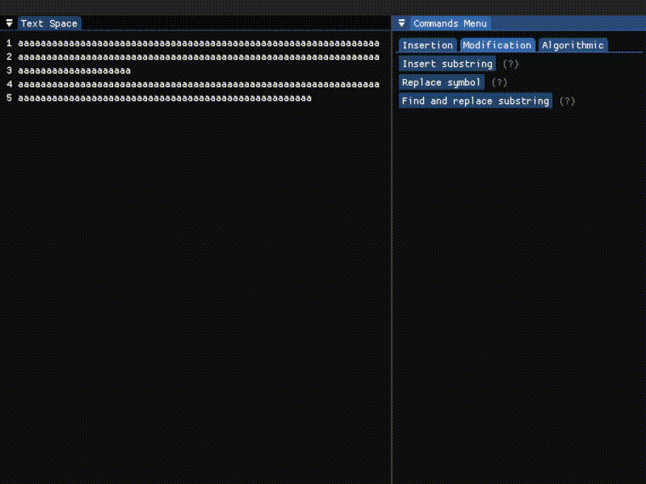
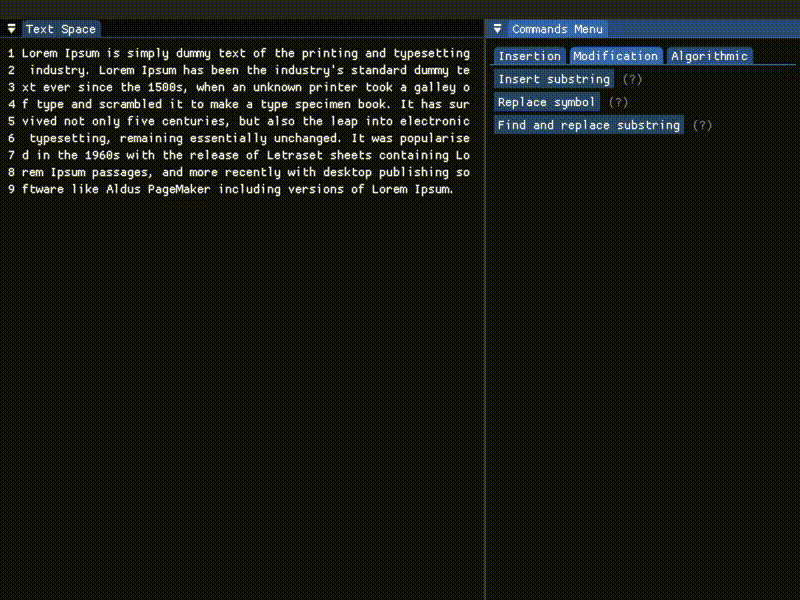

# text-editor

Школьный проект; реализация простейшего построчного текстого редактора. Взаимодействие с текстом осуществляется построчным применением команд. С подробным списком доступных команд можно ознакомиться [ниже](#реализованные-команды). 

Написано все на C++ с использованием библиотек [SFML](https://github.com/SFML/SFML), [ImGui](https://github.com/ocornut/imgui) и [ImGui-SFML](https://github.com/SFML/imgui-sfml).


### Сборка и запуск
Рекомендую использовать новейшие версии Visual Studio: не знаю как все будет работать в других системах(((

Для начала клонируем репозиторий 
```
git clone https://github.com/Shpana/text-editor
```
а потом запускаем premake5 для генерации vs-решения или make-файлов
```
vendor/premake5/premake5.exe {gmake, vs2019, vs2022...}
```

### Реализованные команды

#### Вставка строк

- Вставка строки после $n$-ой строки

<p align="center">
      
</p>

- Вставка одной после $n$-ой строки, но еще и повторить $k$ раз

<p align="center">
  
</p>

- Вставка нескольких строк, начиная с $n$-ой

<p align="center">
  
</p>

- удаление $n$-ой строки

<p align="center">
  
</p>

#### Простая модификация строк

- Вставить подстроку в $n$-ую строку, начиная с $m$-ой позиции

<p align="center">
  
</p>

- Заменить $m$-ый символ в $n$-ой строке

<p align="center">
  
</p>

- Найти подстроку и заменить начиная с $n_1$-ой строки, заканчивая $n_2$-ой строкой

<p align="center">
  
</p>
