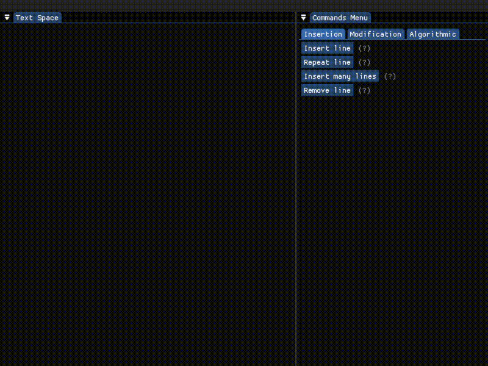
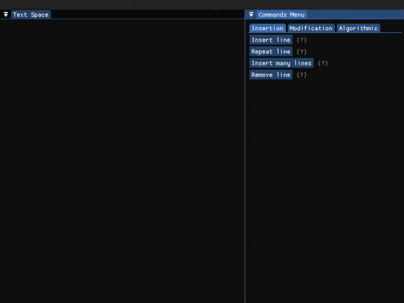

# text-editor

Школьный проект; реализация простейшего построчного текстого редактора. Взаимодействие с текстом осуществляется построчным применением команд. С подробным списком доступных команд можно ознакомиться [ниже](#реализованные-команды). 

Написано все на C++ с использованием библиотек [SFML](https://github.com/SFML/SFML), [ImGui](https://github.com/ocornut/imgui) и [ImGui-SFML](https://github.com/SFML/imgui-sfml).


### Сборка и запуск
Рекомендую использовать новейшие версии Visual Studio: не знаю как все будет работать в других системах(((

Для начала клонируем репозиторий 
```
git clone https://github.com/Shpana/text-editor
```
а потом запускаем premake5 для генерации vs-решения или make-файлов
```
vendor/premake5/premake5.exe {gmake, vs2019, vs2022...}
```

### Реализованные команды

##### Вставка строк

- вставка одной строки после $n$-ой <p align="center"></p>
- вставка одной строки после $n$-ой, но еще повторить $k$ раз <p align="center"></p>
- вставка нескольких строк, начиная с $n$-ой <p align="center"></p>
- удаление строки по номеру $n$ <p align="center"></p>

##### Простая модификация строк

- вставить подстроку в $n$-ую строку, начиная с $m$-ой позиции <p align="center"></p>
- заменить $m$-ый символ в $n$-ой строке <p align="center"></p>
- найти подстроку и заменить <p align="center"></p>